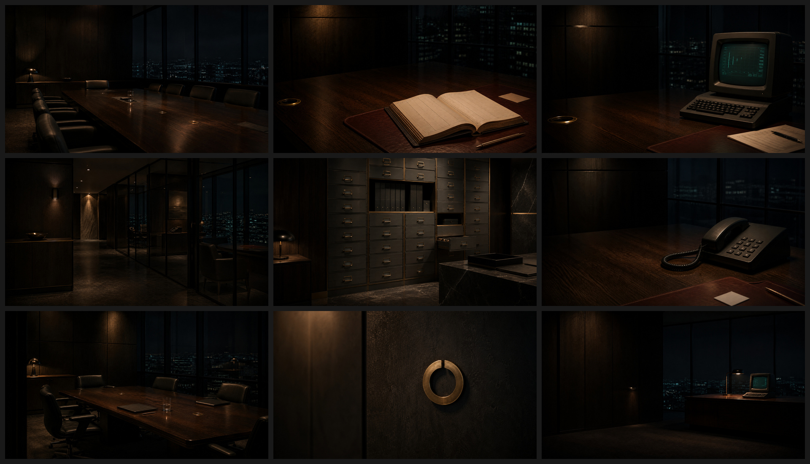

# Omarchy Oligarchy Theme

A dark executive theme for Omarchy built from warm graphite, antique brass, blackened walnut, ivory, oxblood, and restrained institutional colors.

> Free software. Expensive patrons.



## Install

```sh
omarchy theme install https://github.com/YOUR_GITHUB_USERNAME/omarchy-oligarchy-theme
```

## Palette

<table>
  <thead><tr><th>Role</th><th>Hex</th></tr></thead>
  <tbody>
    <tr><td>Mode</td><td><code>dark</code></td></tr>
    <tr><td>Accent</td><td><code>#B29A5C</code></td></tr>
    <tr><td>Selection</td><td><code>#373326</code></td></tr>
    <tr><td>Muted</td><td><code>#969284</code></td></tr>
    <tr><td>Background</td><td><code>#181918</code></td></tr>
    <tr><td>Dark background</td><td><code>#131412</code></td></tr>
    <tr><td>Darker background</td><td><code>#0C0D0C</code></td></tr>
    <tr><td>Lighter background</td><td><code>#272925</code></td></tr>
    <tr><td>Foreground</td><td><code>#D9D3BF</code></td></tr>
    <tr><td>Dark foreground</td><td><code>#938F81</code></td></tr>
    <tr><td>Light foreground</td><td><code>#E7E0CC</code></td></tr>
    <tr><td>Bright foreground</td><td><code>#F4ECD7</code></td></tr>
    <tr><td>Red</td><td><code>#C86D65</code></td></tr>
    <tr><td>Yellow</td><td><code>#CBAE5C</code></td></tr>
    <tr><td>Orange</td><td><code>#C97D50</code></td></tr>
    <tr><td>Green</td><td><code>#78A579</code></td></tr>
    <tr><td>Cyan</td><td><code>#6AA4A2</code></td></tr>
    <tr><td>Blue</td><td><code>#6A87B5</code></td></tr>
    <tr><td>Magenta</td><td><code>#A57998</code></td></tr>
    <tr><td>Brown</td><td><code>#735744</code></td></tr>
    <tr><td>Bright red</td><td><code>#E18579</code></td></tr>
    <tr><td>Bright yellow</td><td><code>#E3C66C</code></td></tr>
    <tr><td>Bright green</td><td><code>#94BE91</code></td></tr>
    <tr><td>Bright cyan</td><td><code>#83BFBC</code></td></tr>
    <tr><td>Bright blue</td><td><code>#86A5D4</code></td></tr>
    <tr><td>Bright magenta</td><td><code>#BF92B1</code></td></tr>
  </tbody>
</table>

## Compatibility

Built for current Omarchy v4 / Quattro theming.
